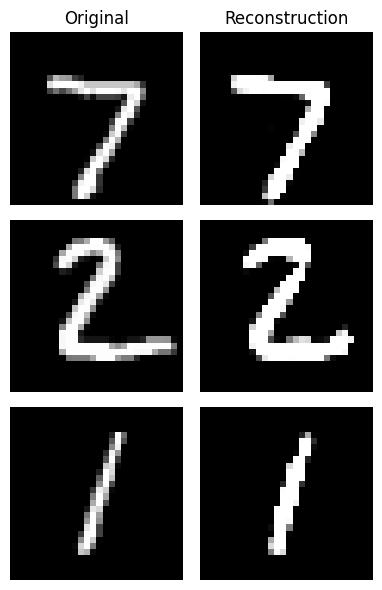
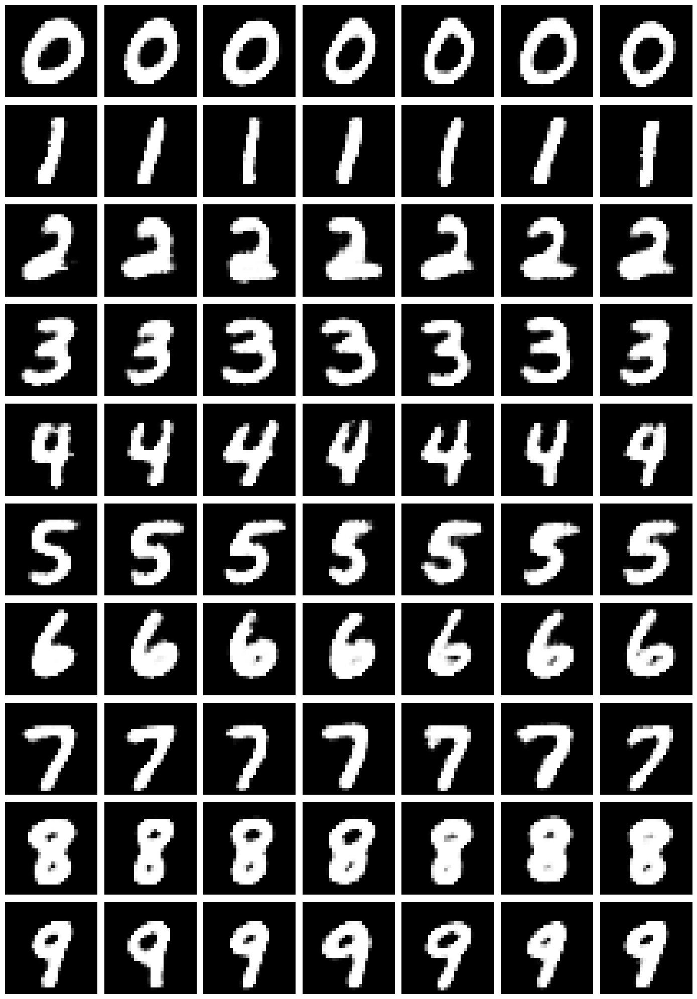
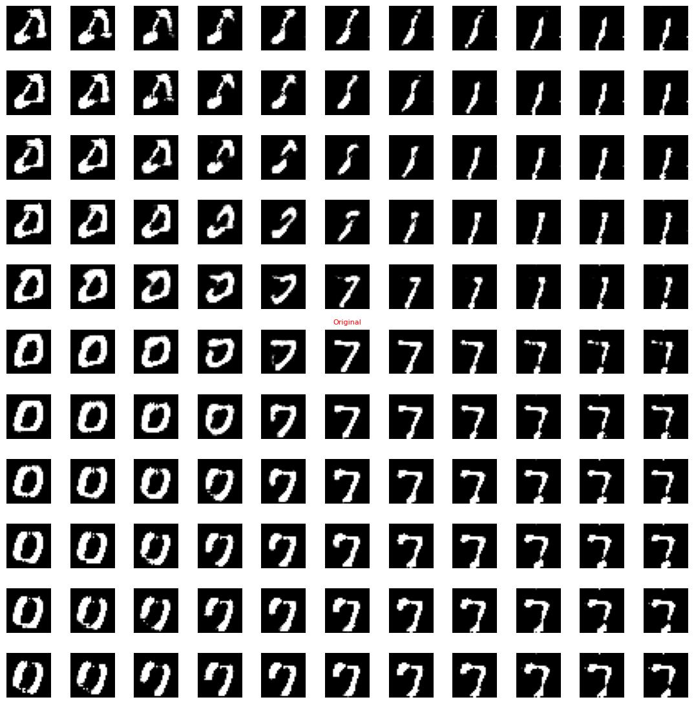

# MNIST AI Sandbox

This repository contains applications of various machine learning architectures to the MNIST dataset. MNIST is a labeled dataset of handwritten digits, where the main task is to classify each image into the correct number (0-9). Beyond classification, this project also explores generative AI techniques to create new digit images.

The models examined include classic neural networks, convolutional neural networks (CNNs), autoencoders, variational autoencoders (VAEs), conditional VAEs (CVAEs), and generative adversarial networks (GANs).

All models are implemented using **PyTorch**.

## Installation

To set up the environment, create a Conda environment from the provided `environment.yml` file:

```bash
conda env create -f environment.yml
conda activate mnist-sandbox
```

## Showcase

### CVAE Reconstruction Examples



### Beta-CVAE Generated Digits



### VAE Latent Space Exploration


